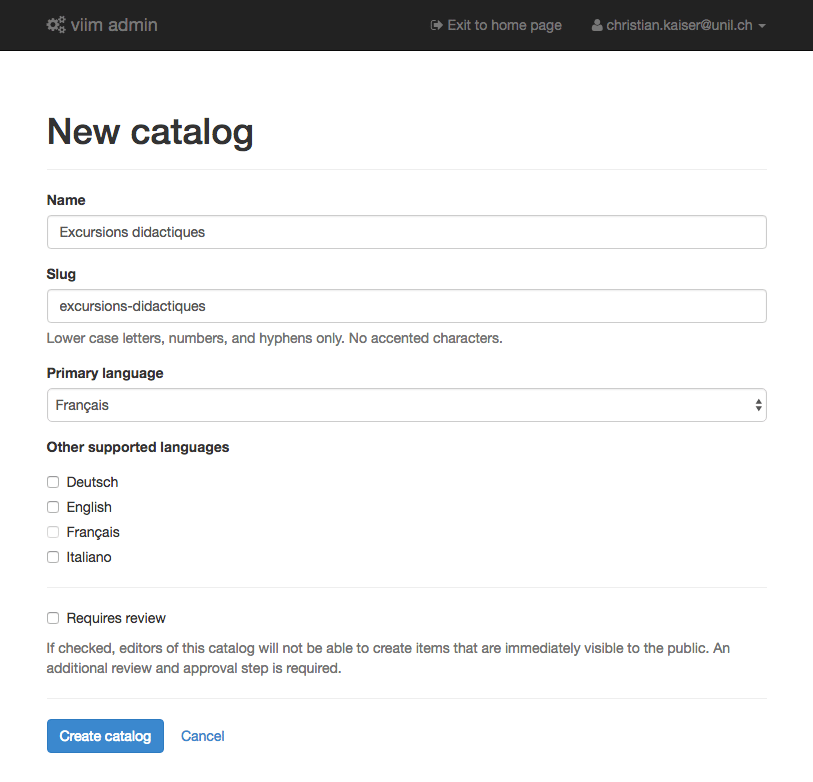
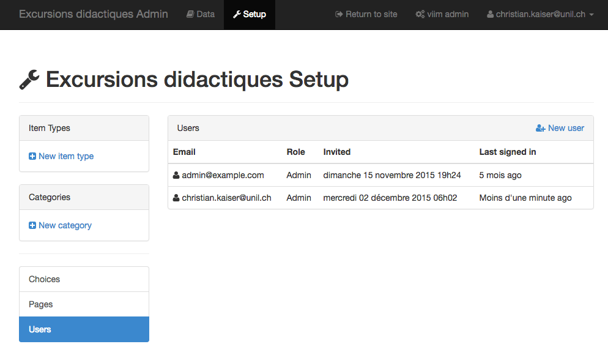

# Démarrer avec CATIMA

Le mieux pour apprendre à utiliser CATIMA est de créer un catalogue. Dans ce petit tutoriel, nous allons créer un catalogue d'excursions didactiques. Chaque excursion possède un parcours à suivre à pied et plusieurs postes avec des informations sur le lieu, son histoire, des faits scientifiques intéressants y relatifs etc. Les [GéoGuides](http://igd.unil.ch/geoguide) de la FGSE sont des exemples typiques de ce genre d'excursions.

---

<!-- **TODO** Il faudrait probablement d'abord faire une partie sur la modélisation de données. Décrire la structure du catalogue d'abord sur papier. -->

Pour commencer, nous nous rendons sur [catima.unil.ch](https://catima.unil.ch), et nous devons d'abord nous authentifier (cliquer sur *CATIMA admin*).

## Créer un nouveau catalogue
Uniquement un *administrateur de système* peut créer un nouveau catalogue (les différents rôles et droits sont décrits dans la section suivante).

Si l'administrateur responsable a déjà créé le catalogue, il apparait alors dans notre liste.
<!-- **FUTURE CHANGE** There is an open ticket to change this behaviour. The user should be able to create his own catalog. He is then the *catalog owner*, and he can give access rights for his catalog to other users (admin / editor). -->
Pour définir un catalogue, l'administrateur système a besoin des informations suivants:

- Le **nom** du catalogue.
- Le ***slug*** du catalogue. Un *slug* est une partie d'une URL, et ne peut être composé uniquement de caractères minuscules sans accents, des nombre et des tirets. Généralement, le slug est une version simplifiée du nom.
- La **langue primaire**.
- CATIMA supporte plusieurs langues (actuellement français, anglais, allemand et italien). Il est alors possible de définir en option une ou plusieurs **langues supplémentaires**.
- CATIMA supporte des catalogue avec ou sans **validation**. En cas d'un catalogue avec validation, un administrateur du catalogue doit donner son aval avant que l'élément en question est visible en ligne.

Voici une capture d'écran pour la création d'un catalogue par un administrateur de système:

> L'interface d'administration de CATIMA n'est disponible qu'en anglais, tandis que l'interface publique des catalogues est disponible dans les langues définies dans les propriétés du catalogue.

## Les rôles et droits des utilisateurs

Dans CATIMA, chaque utilisateur prend un rôle bien défini:

- Le **visiteur** peut consulter les données des catalogues publiques. C'est le rôle par défaut si quelqu'un arrive sur CATIMA.
- Un **utilisateur CATIMA** est un visiteur qui s'est enregistré, mais qui n'a pas de droits spécifiques. Par rapport au *visiteur*, la seule chose qu'il peut faire en plus est d'enregistrer des favoris, des résultats de recherche et de prendre des notes directement dans l'interface de CATIMA.
- Un **éditeur de catalogue** est un utilisateur qui a obtenu de la part d'un *administrateur de catalogue* le droit d'éditer les données d'un catalogue. L'éditeur ne peut pas modifier la structure des données du catalogue.
- L'**administrateur de catalogue** peut modifier tout le catalogue, y compris sa structure de données (ajouter des objets, des champs etc.). Il peut également inviter d'autres utilisateurs à devenir *éditeur de catalogue* ou *administrateur de catalogue*.
- L'**administrateur système** supervise le fonctionnement de CATIMA. Il peut notamment créer et supprimer les catalogue, définir la page d'accueil de CATIMA. Il peut également inviter d'autres utilisateurs à devenir administrateur système.

## Les éléments de base d'un catalogue

Avant de commencer à définir la structure de base du catalogue, l'**écran d'administration du catalogue** ressemble à ça: 

On peut y voir déjà les principaux éléments de base d'un catalogue:

- **«Item Types»**. On peut traduire *item type* avec ***type d'objet***. Un ***objet*** (*item*) est l'objet que nous désirons enregistrer dans le catalogue, donc p.ex. une excursion, respectivement les différents postes le long d'une excursion. Le *type d'objet* définir la *structure* de l'objet, c'est-à-dire l'ensemble des ***champs*** qui caractérisent l'objet.
- Les **«Categories»** (*catégories* en français) permettent d'étendre les caractéristiques d'un objet de manière flexible. Il s'agit d'un concept relativement avancé et ce sujet sera donc traité un peu plus tard.
- Les **«Choices»** ou **«Choice sets»** correspondent à une **liste de choix** où un choix est composé d'un nom et optionellement d'un nom long. Une liste de choix permet de restreindre les valeurs possibles d'un champ, et de naviguer entre les objets partageant les mêmes choix.
- Les **«Pages»** permettent d'ajouter des pages supplémentaires avec du contenu libre.
- Les **«Users»** sont les utilisateurs d'un catalogue, avec n'importe quel rôle (utilisateur, éditeur ou administrateur).

Pour mettre en place la structure d'un catalogue, nous devons typiquement définir les différents *types d'objets* (*item types*). Afin de pouvoir faire cela, nous devons savoir exactement quelle est la structure des données du catalogue. On commencera alors par définir la *structure des données*, par exemple sur du papier, pour ensuite la traduire en *structure de catalogue* correspondante.

## Définir la structure des données

La définition de la structure des données permet d'identifier les différents types d'objets d'un catalogue ainsi que les liens entre ces types d'objets. En plus, la structure des données comprend également la définition des différentes caractéristiques de chaque type d'objet. La définition de **la structure des données peut se faire très bien avec papier et crayon**. Nous montrons cette étape de structuration des données à l'aide de l'exemple du catalogue des excursions didactiques cité en introduction.

Le catalogue des excursions didactiques contiendra dans l'essentiel les ***types d'objets*** suivants (cette liste va varier d'une personne à l'autre et va typiquement évoluer pendant l'exercice de structuration des données):

1. L'**excursion didactique** elle-même. Une excursion possède plusieurs postes d'information.
2. Les **postes** qui sont les endroits situés le long d'une excursion didactique (ou potentiellement plusieurs) et qui présentent une ou plusieurs thématiques.
3. Une **thématique** est un champ d'intérêt et/ou un domaine scientifique qui permet de regrouper les différents postes pour une meilleure information des personnes intéressées dans ces excursions.

Pour chaque *type d'objet*, nous allons devoir définir les caractéristiques sous forme de ***champs*** (*«fields»*). Chaque champ représente une caractéristique particulière. Nous pouvons tenter une première définition de nos 3 types d'objets de manière graphique:

