# Mode d'emploi: CATIMA
[TOC]

----------

## Introduction
### Introduction: CATIMA, c'est quoi?
CATIMA est un projet informatique développé par la [Faculté des lettres](https://unil.ch/lettres) et la [Faculté des géosciences et de l'environnement (FGSE)](https://unil.ch/gse) de l'[Université de Lausanne](https://unil.ch/). Le logiciel est accessible grâce à l'URL [catima.unil.ch](catima.unil.ch). 

Le principe de CATIMA est de permettre à un utilisateur qui ne possède pas forcément de connaissances en informatique de créer des **catalogues de documents structurés** en ligne. Il crée un document, décrit par une fiche composée de plusieurs champs définis en avance et représentant un objet précis. Grâce au contenu de cette fiche, il va pouvoir ensuite faire des liens avec d'autres objets enregistrés dans le catalogue.

CATIMA est en quelque sorte une alternative en ligne à une base de données, comme par exemple FileMaker. Cependant, elle n'offre pas certaines fonctions typiques que pourraient proposer d’autres « vraies » bases de données, comme par exemple la création de requêtes complexes. Le but de CATIMA est de rester accessible à tout public. Par contre, CATIMA permet de naviguer facilement à travers les données, de chercher des objets et permet aux éditeurs d'ajouter et de modifier les données.

### Démarrer avec CATIMA
Dans ce mode d’emploi, vous allez tout d’abord pouvoir découvrir les termes essentiels à la compréhension du logiciel ainsi que le fonctionnement des outils principaux. Ensuite, étape par étape, vous verrez comment créer un catalogue car la meilleure façon d’apprendre à utiliser CATIMA est de faire soi-même un catalogue en parallèle aux indications.

----------

## Les bases

###Les rôles et droits des utilisateurs
Pour commencer, il est préférable de savoir quels sont les types d’utilisateurs du logiciel CATIMA ainsi que leurs rôles et droits. On compte six types d’utilisateurs ayant un rôle bien défini, soit :

* __Le visiteur (visitor)__ : il peut consulter les données des catalogues qui ont été rendus publics. C'est le rôle par défaut si quelqu'un arrive sur CATIMA et ne possède pas de compte.
* __L’utilisateur CATIMA (user)__ : c’est un visiteur qui s'est enregistré et donc qui possède un compte, mais qui n'a aucun droit particulier. Par rapport au visiteur, la seule chose que l’utilisateur CATIMA peut faire en plus est d'enregistrer des favoris, des résultats de recherche et de prendre des notes directement dans l'interface de CATIMA.
* __L’éditeur de catalogue (editor)__ : cet utilisateur ne peut pas modifier la structure des données d’un catalogue, mais il a cependant obtenu le droit d'éditer. Il peut donc entrer des données dans ce catalogue.
* __Le relecteur (reviewer)__ : cet utilisateur peut éditer des données dans un catalogue et décider si ce catalogue est publiable ou non.
* __L'administrateur de catalogue (admin)__ : il peut modifier tout le catalogue, y compris la structure des données (ajouter des objets, des champs etc.). Il peut également inviter d'autres utilisateurs à devenir éditeur de catalogue ou administrateur de catalogue.
* __L'administrateur système__ : il supervise le fonctionnement de CATIMA. Il peut notamment créer et supprimer des catalogues, définir la page d'accueil de CATIMA. Il peut aussi inviter d'autres utilisateurs à devenir administrateur système.

###Création d'un compte "administrateur de catalogue"
Uniquement un _administrateur système_ peut créer un nouveau catalogue (cf. "[Les rôles et droits des utilisateurs](#les-rôles-et-droits-des-utilisateurs)" , section précédente). Pour ce faire, l'administrateur système a besoin des informations suivantes :

* Le __nom__ du catalogue désiré par l’utilisateur ;
* Le __slug__ du catalogue qui est en fait la partie d'une URL qui viendra se placer à la fin de l’URL générale de CATIMA (soit juste à la suite de l’URL du site et qui définira ainsi l’adresse de la page d’accueil de votre catalogue). Ce slug doit être composé uniquement de caractères minuscules (sans accents), de nombres et de tirets. Généralement, vous choisirez pour le slug une version simplifiée du nom choisi pour le catalogue.
  Si le slug souhaité a déjà été attribué, un message d’erreur apparaît et vous invite à choisir un autre slug.
* La __langue primaire__ : il faut savoir que CATIMA supporte plusieurs langues (actuellement français, anglais, allemand et italien). Il est alors possible de définir la langue principale du catalogue mais aussi de sélectionner en option une ou plusieurs __langues supplémentaires__.
  Par la suite, lors de chaque création d’objets ou champs, il sera automatiquement demandé à l’utilisateur de donner les informations en langue primaire mais aussi dans les langues supplémentaires.

CATIMA supporte des __catalogues validés__ ou __non-validés__. Tant qu’un catalogue n’est pas validé par l’administrateur de système, il n’est pas visible dans la liste des catalogues existants qui apparait sur la page d’accueil de CATIMA. Dans ce cas, seuls les utilisateurs qui connaissent l’URL entière du catalogue en question peuvent y avoir accès, en l’insérant dans la barre de recherche du navigateur web. Dans le cas où l’administrateur du catalogue souhaite obtenir une validation de son travail, il doit s’adresser à l’administrateur de système qui donnera son accord ou non avant de rendre le catalogue visible en ligne.

###Les termes et outils essentiels 
La première page de votre catalogue se présente ainsi:
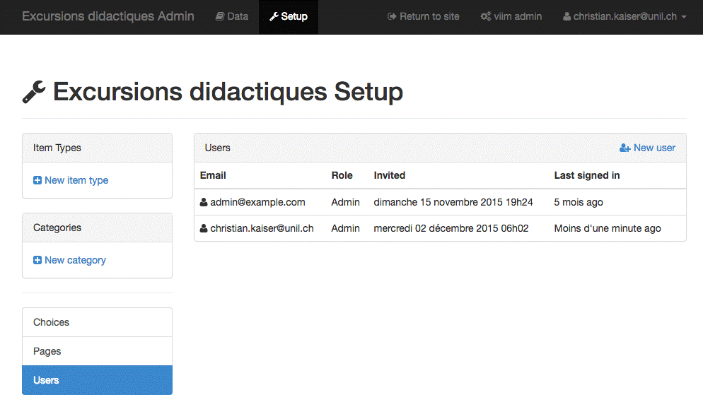

Vous accédez en fait directement à la liste des autres utilisateurs. Depuis cette interface, vous pouvez décider d’autoriser d’autres utilisateurs à éditer votre catalogue, autrement dit à y ajouter des données.

Avant toute chose, il faut souligner que l'interface d'administration de CATIMA n'est disponible qu'en anglais. Cependant l'interface publique des catalogues est disponible dans les langues définies dans les propriétés du catalogue lors de sa création.

Ensuite, vous remarquerez que la barre sur la gauche est composée de différentes catégories. Voici plus en détails ce que chacune d’entre elles représente :

* __Item Types (types d’objet)__ : dans votre catalogue, ce sont les objets (*items*) que vous désirez enregistrer. Grâce à la rubrique "_item types_", vous pouvez définir la structure de l'objet que vous allez ensuite mémoriser dans votre catalogue. Pour créer cette structure, vous mettrez donc sur pied un ensemble de __champs__ qui caractérisent l’item. Les __champs__ sont les diverses informations que porte votre objet.
* __Categories (catégories)__ : elles permettent d'étendre les caractéristiques d'un objet de manière flexible. Il s'agit d'un concept relativement avancé et ce sujet sera traité un peu plus tard dans ce mode d’emploi.
* __Choices (choix)__ : ils correspondent à une __liste de choix__ où un choix est composé d'un nom court et optionnellement d'un nom long. Une liste de choix permet de restreindre les valeurs possibles d'un champ, et de naviguer entre les objets partageant les mêmes choix.
* __Pages (pages)__ : elles permettent d'ajouter des pages supplémentaires avec du contenu libre.
* __Users (utilisateurs)__ : comme déjà vu précédemment, ce sont les utilisateurs d'un catalogue, avec n'importe quel rôle (utilisateur, éditeur ou administrateur).

Il faut aussi retenir que lorsque votre premier objet (*item*) sera créé et enregistré, une nouvelle rubrique va apparaître dans cette barre d’outils. __"Menu items" (menu d’objets)__ va prendre place entre "_Pages_" et "_Users_". Dans cette rubrique, il nous sera possible de paramétrer l’affichage de vos objets dans le catalogue. Vous verrez plus tard tout ce qu’il est possible d‘y faire, par exemple y gérer l’ordre des onglets, y créer des listes déroulantes pour un onglet, définir le format et la mise en page, etc.

Observez maintenant de plus près la barre noire qui s’affiche en haut de la page :
  

* __"Catalogue Manuel Admin"__ : ici, CATIMA vous indique que vous êtes connectés en tant qu’admin de ce catalogue et que vous pouvez donc modifier la structure et les données de ce dernier. Notez que "Manuel" est le nom donné au catalogue à sa création.
* __"Data"__ : C’est la rubrique qui vous permet d’accéder directement aux listes d’images et données. C’est également depuis cette rubrique que vous pouvez ajouter des données.
> _Pour plus d’information à ce sujet, référez-vous à la section "[Data, explications](#data-explications)" qui se trouve plus bas dans le mode d’emploi._
* __"Setup"__ : C’est la rubrique qui vous permet de créer ou modifier la structure que vous souhaitez donner à votre catalogue. C’est depuis cet endroit qu’il vous est possible de paramétrer tous les liens que vous désirez.
>_Pour plus d’information à ce sujet, référez-vous à la section "[Setup, explications](#setup-explications)" qui se trouve plus bas dans le mode d’emploi._

* __"Help"__ : en cliquant ici, vous accédez directement au mode d’emploi et aux explications sur l’utilisation de CATIMA.
* __"Return to site"__ : en cliquant ici, vous serez directement redirigés vers la version en ligne de votre catalogue (soit la version "site internet"), qui est en fait celle que tous les utilisateurs visiteurs pourront voir et consulter.
* __"Adresse-mail"__ : ici s’affiche votre compte. Vous pouvez soit vous déconnecter en cliquant sur "_Log out_", soit modifier votre profil sur "_My profile_" où vous avez la possibilité de changer votre adresse-mail, votre mot de passe ou même supprimer votre propre compte. 

----------

## Setup, Explications

###Rubrique "Item Type"

Pour ajouter un objet, il faut toujours procéder de la même manière : vous cliquez sur "_+ New Item Type_" en bas de la rubrique "_Item type_", dans la barre de gauche. La liste suivante s’affiche :

Vous remarquerez que vous devez choisir un nom général pour votre objet.

CATIMA vous demande automatiquement d‘entrer le __nom__ de l’objet en langue primaire, mais aussi de le traduire dans les langues secondaires que vous aviez définies lors de la création du catalogue, l’administrateur système avait alors paramétré votre choix de langues.

Il vous faut aussi entrer le nom au pluriel. Cette étape est importante. Lorsqu’une recherche d’un objet sera lancée dans votre catalogue, il sera plus facile de le retrouver si les deux versions du nom existent. De plus, CATIMA affiche par défaut la version au pluriel comme en-tête des onglets.

Un __slug__ au pluriel est aussi requis pour chaque nouvel objet que vous créez. Comme vous l’avez déjà vu plus haut, il s’agit en fait de choisir la partie d'une URL qui viendra se placer à la fin de l’URL générale de votre catalogue (soit juste à la suite de l’URL de la page d’accueil de votre catalogue). Rappellez-vous que ce slug doit être composé uniquement de caractères minuscules (sans accent), de nombres et de tirets et qu’en général, le slug est une version simplifiée du nom choisi pour l’objet (item). Si le slug souhaité a déjà été attribué, un message d’erreur apparaît et il vous faudra en choisir un autre.

Pour enregistrer, cliquez sur "_Create item type_". L’objet, créé à l’instant, va apparaître dans la barre de gauche, dans la rubrique "_Item Types_". Si vous souhaitez enregistrer votre objet et en ajouter un autre, vous avez aussi la possibilité de cliquer sur "_Create and add another_", CATIMA va donc directement vous ouvrir une nouvelle liste à remplir pour un nouvel objet. À tout moment, vous pouvez annuler en cliquant sur "_Cancel_".

###Paramétrage d'un objet (item)
Une fois que les objets ont été créés, il vous faut les paramétrer, autrement dit leur donner une forme. Pour faire ceci, vous devez sélectionner l’objet souhaité dans la barre de gauche. Vous verrez apparaitre les informations suivantes :

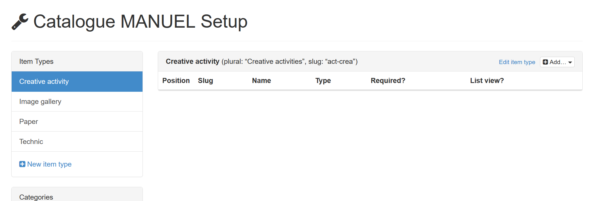

 Vous remarquerez le récapitulatif des noms et du slug, contenu dans la ligne grise. Vous pouvez sans autre changer ces quelques informations en cliquant sur "*Edit item type*", affiché en bleu, sur la droite.

Sur la ligne juste en-dessous, vous pouvez lire les en-têtes suivants : "*Position*", "*Slug*", "*Name*", "*Type*", "*Required ?*", "*List view ?*". Cette partie sera complétée automatiquement par CATIMA et fera sens dès que vous aurez paramétré des champs. En ajoutant un champ, les paramètres que vous allez choisir et enregistrer vont ensuite s’afficher sur cette page sous la forme d’une petite liste récapitulative. Les différentes colonnes seront remplies selon les options que vous aurez ordonnées et seront à tout moment modifiables.

Maintenant, il va falloir ajouter des **champs** à notre objet. Cela est réalisable grâce à la liste déroulant "*+ Add…*" . Tout un choix s’offre à vous :

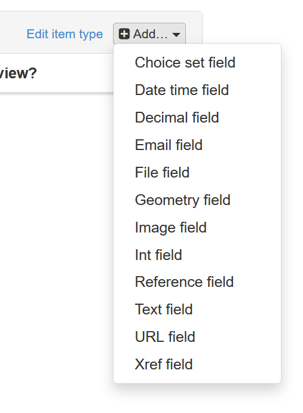

Chacun de ces champs est une information qui va paramétrer votre objet. Chaque champ est de type différent et ne permettra donc qu’un unique format d’information. Par exemple, si vous choisissez le champ « décimal », alors les données qui seront entrées dans ce champ ne pourront être que des nombres.

C’est grâce à ces champs que d’une part, vous allez pouvoir trier vos données et d’autre part, faire des liens entre toutes les informations qui composent votre catalogue.

Nous allons regarder ensemble tous les types de champs qui sont proposés dans cette liste déroulante afin de mieux comprendre comment il sera possible de facilement trier et lier les données entre elles.

####Champ 'ensemble de choix' (Choice set field)

Un **ensemble de choix** est une liste qui est composée de noms courts et optionnellement de noms longs. Cette liste permet de restreindre les valeurs possibles d'un champ, d’identifier les champs suivants et de naviguer entre les objets partageant les mêmes choix (autrement dit les mêmes noms courts et/ou noms longs).

Ici, à nouveau, CATIMA vous demande automatiquement d‘entrer les informations suivantes :

* Le **nom** du nouveau champ 'ensemble de choix' en langue primaire, mais aussi traduit dans les langues secondaires;
* La **version plurielle** du nom dans toutes les langues ;
* Un **slug** au singulier est aussi requis pour chaque nouveau champ. Comme vous le savez déjà, il s’agit de choisir la partie d'une URL qui viendra se placer à la fin de l’URL générale de votre catalogue. Petit conseil : choisissez une version simplifiée du nom donné à ce champ. Rappel :  le slug doit être composé uniquement de caractères minuscules (sans accent), de nombres et de tirets. Si le slug souhaité a déjà été attribué, un message d’erreur apparaît et il faudra en choisir un autre ;
* Un **commentaire** optionnel peut être intégré ;
* Un paramétrage pour les **options d’affichage** ("*Display options*") : vous cochez cette case si vous souhaitez utiliser le champ comme champ primaire ("*primary field*") ou non, autrement dit si vous voulez que ce champ soit celui qui définisse l’ordre alphabétique de tous les champs qui forment votre objet. Par conséquent, cette option n’est réalisable que pour un unique champ de votre objet. Une fois cochée pour un champ, il ne vous sera plus possible de la sélectionner lors de la création des champs suivants. Vous pouvez aussi choisir si vous désirez ou non que ce champ soit visible dans la liste des données lorsque vous vous trouvez dans la rubrique "*Data*".
>_Pour plus d’information sur la partie "Data", référez-vous à la section "[Data, explications](#data-explications)"._

* Un paramétrage pour les **options d’entrée** ("*Data entry options*") : vous sélectionnez dans la liste déroulante l’option qui va paramétrer le nombre de données possibles pour ce champ.
  CATIMA vous propose les choix suivants :
  "*Single value – optional*", "*Single value – required*", "*Multiple values – optional*" ou "*Multiple values – required*"
  Autrement dit, vous pouvez choisir si une donnée est obligatoire ou optionnelle et s’il doit y en avoir une seule ou si vous pouvez en entrer plusieurs dans un même champ.
* "*Must be unique*" : cette option vous permet d’ordonner ou non à CATIMA de bien vérifier que chacune des données soit **unique**, c’est-à-dire qu’aucune donnée saisie ne soit identique à celles déjà entrées dans le catalogue. 
* "*Choice set*" : grâce à cette liste déroulante, vous pouvez sélectionner l'**ensemble de choix** avec lequel vous souhaitez travailler. 

Donc vous enregistrez votre champ 'ensemble de choix' et les différents paramètres (que vous pourrez modifier sans autre par la suite) ou alors vous annulez en cliquant sur "*Cancel*". 

####Champ 'date et heure' (Date time field)

Grâce à ce type de champ, il est possible de paramétrer un champ pour des données qui seront entrées sous forme numérique, soit plus précisément : des **données de date ou d’horaire**. Donc ce champ est uniquement dédié aux données temporelles. À nouveau, CATIMA vous demande d‘entrer les informations suivantes : (vous remarquerez que pour chaque type de champ, la démarche est presque identique !)

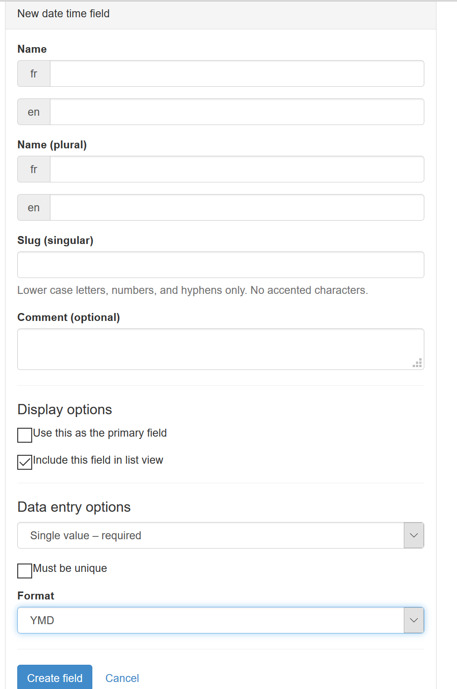

* Le **nom** du nouveau champ ‘date et heure’ en langue primaire, mais aussi traduit dans la/les langue(s) secondaire(s) ;
* La **version plurielle** du nom dans toutes les langues ;
* Un **slug** au singulier est aussi requis pour chaque nouveau champ. Comme vous le savez déjà, il s’agit de choisir la partie d'une URL qui viendra se placer à la fin de l’URL générale de votre catalogue. Petit conseil : choisissez une version simplifiée du nom donné à ce champ. Rappel :  le slug doit être composé uniquement de caractères minuscules (sans accent), de nombres et de tirets. Si le slug souhaité a déjà été attribué, un message d’erreur apparaît et il faudra en choisir un autre ;
* Un **commentaire** optionnel peut être intégré ;
* Un paramétrage pour les **options d’affichage** ("*Display options*") : vous cochez cette case si vous souhaitez utiliser le champ comme champ primaire ("*primary field*") ou non, autrement dit si vous voulez que ce champ soit celui qui définisse l’ordre alphabétique de tous les champs qui forment votre objet. Par conséquent, cette option n’est réalisable que pour un unique champ de votre objet. Une fois cochée pour un champ, il ne vous sera plus possible de la sélectionner lors de la création des champs suivants. Vous pouvez aussi choisir si vous désirez ou non que ce champ soit visible dans la liste des données lorsque vous vous trouvez dans la rubrique "*Data*".
>_Pour plus d’information sur la partie "Data", référez-vous à la section "[Data, explications](#data-explications)"._

* Un paramétrage pour les **options d’entrée** ("*Data entry options*") : vous sélectionnez dans la liste déroulante l’option qui va paramétrer le nombre de données possibles pour ce champ.
  CATIMA vous propose les choix suivants : "*Single value – optional*", "*Single value – required*". Autrement dit, vous pouvez choisir si une ‘donnée de date/horaire’ est obligatoire ou optionnelle.
* "*Must be unique*" : cette option vous permet d’ordonner ou non à CATIMA de bien vérifier que chacune des données soit **unique**, c’est-à-dire qu’aucune donnée saisie ne soit identique à celle qui a déjà été entrée dans le catalogue auparavant. 
* "**Format**" : grâce à cette liste déroulante, vous pouvez sélectionner le format que vous désirez donner aux données qui seront intégrées dans ce champ. Vous avez le choix entre six formats différents, soit : "Y", "YM", "YMD", "YMDh", "YMDhm", "YMDhms" (autrement dit, vous pouvez varier entre différentes combinaisons "année-mois-jour-heure-minute-seconde" ).

#### Champ 'décimal' (Decimal field)

Ici, vous paramétrez un champ pour des données qui seront entrées uniquement sous **forme numérique/décimale**, autrement dit que des nombres. CATIMA vous demande d‘entrer les informations suivantes : (vous remarquerez que pour chaque type de champ, la démarche est presque identique !)

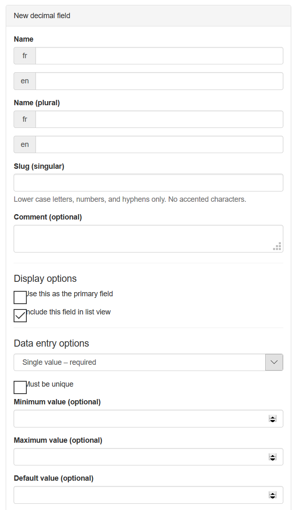

* Le **nom** du nouveau champ ‘décimal’ en langue primaire, mais aussi traduit dans la/les langue(s) secondaire(s) ;
* La **version plurielle** du nom dans toutes les langues ;
* Un **slug** au singulier est aussi requis pour chaque nouveau champ. Comme vous le savez déjà, il s’agit de choisir la partie d'une URL qui viendra se placer à la fin de l’URL générale de votre catalogue. Petit conseil : choisissez une version simplifiée du nom donné à ce champ. Rappel :  le slug doit être composé uniquement de caractères minuscules (sans accent), de nombres et de tirets. Si le slug souhaité a déjà été attribué, un message d’erreur apparaît et il faudra en choisir un autre ;
* Un **commentaire** optionnel peut être intégré ;
* Un paramétrage pour les **options d’affichage** ("*Display options*") : vous cochez cette case si vous souhaitez utiliser le champ comme champ primaire ("*primary field*") ou non, autrement dit si vous voulez que ce champ soit celui qui définisse l’ordre alphabétique de tous les champs qui forment votre objet. Par conséquent, cette option n’est réalisable que pour un unique champ de votre objet. Une fois cochée pour un champ, il ne vous sera plus possible de la sélectionner lors de la création des champs suivants. Vous pouvez aussi choisir si vous désirez ou non que ce champ soit visible dans la liste des données lorsque vous vous trouvez dans la rubrique "*Data*".
>_Pour plus d’information sur la partie "Data", référez-vous à la section "[Data, explications](#data-explications)"._

* Un paramétrage pour les **options d’entrée** ("*Data entry options*") : vous sélectionnez dans la liste déroulante l’option qui va paramétrer le nombre de données possibles pour ce champ.
  CATIMA vous propose les choix suivants : "*Single value – optional*", "*Single value – required*". Autrement dit, vous allez pouvoir choisir si une ‘donnée décimale’ est obligatoire ou optionnelle.
* "*Must be unique*" : cette option vous permet d’ordonner ou non à CATIMA de bien vérifier que chacune des données soit **unique**, c’est-à-dire qu’aucune donnée saisie ne soit identique à celles déjà entrées dans le catalogue. 
* "*Minimum value*" : cette option est facultative. Elle vous permet de donner à CATIMA une **valeur minimale** d’entrées pour ce champ. Dans le cas où les données que vous entrerez par la suite dans ce champ sont plus petites que le seuil enregistré, elles seront refusées.
* "*Maximum value*" : cette option est aussi facultative. Elle vous permet de donner à CATIMA une **valeur maximale** d’entrée pour ce champ. Si par la suite les données que vous entrerez dans ce champ sont plus élevées que le seuil enregistré, elles seront refusées. 
* "*Default value*" : ici, vous pouvez décider d’une **valeur par défaut** pour chaque nouvelle donnée ne portant pas d’information pour ce champ. Cependant, si la donnée que vous ajoutez possède déjà une information de type décimal à cet endroit, elle viendra remplacer la valeur par défaut. De cette manière, vous vous assurez de toujours avoir une valeur dans ce champ.

À la fin, soit vous enregistrez votre champ ‘décimal’ et les différents paramètres, soit vous annulez en cliquant sur "*Cancel*".

####Champ 'email' (Email field)

Ici, vous paramétrez un champ pour des données qui seront entrées uniquement sous forme d’adresses mail. Il vous faut donc entrer les informations telle que :

* Le **nom** du nouveau champ ‘email’ en langue primaire, mais aussi traduit dans les langues secondaires;
* La **version plurielle** du nom dans toutes les langues ;
* Un **slug** au singulier est aussi requis pour chaque nouveau champ. Comme vous le savez déjà, il s’agit de choisir la partie d'une URL qui viendra se placer à la fin de l’URL générale de votre catalogue. Petit conseil : choisissez une version simplifiée du nom donné à ce champ. Rappel :  le slug doit être composé uniquement de caractères minuscules (sans accent), de nombres et de tirets. Si le slug souhaité a déjà été attribué, un message d’erreur apparaît et il faudra en choisir un autre ;
* Un **commentaire** optionnel peut être intégré ;
* Un paramétrage pour les **options d’affichage** ("*Display options*") : vous cochez cette case si vous souhaitez utiliser le champ comme champ primaire ("*primary field*") ou non, autrement dit si vous voulez que ce champ soit celui qui définisse l’ordre alphabétique de tous les champs qui forment votre objet. Par conséquent, cette option n’est réalisable que pour un unique champ de votre objet. Une fois cochée pour un champ, il ne vous sera plus possible de la sélectionner lors de la création des champs suivants. Vous pouvez aussi choisir si vous désirez ou non que ce champ soit visible dans la liste des données lorsque vous vous trouvez dans la rubrique "*Data*".
>_Pour plus d’information sur la partie "Data", référez-vous à la section "[Data, explications](#data-explications)"._

* Un paramétrage pour les **options d’entrée** ("*Data entry options*") : vous sélectionnez dans la liste déroulante l’option qui va paramétrer le nombre de données possibles pour ce champ.
  CATIMA vous propose les choix suivants : "*Single value – optional*", "*Single value – required*". Autrement dit, vous allez pouvoir choisir si une donnée est obligatoire ou optionnelle.
* "*Must be unique*" : cette option vous permet d’ordonner ou non à CATIMA de bien vérifier que chacune des données soit **unique**, c’est-à-dire qu’aucune donnée saisie ne soit identique à celles déjà entrées dans le catalogue. 
* "*Default value*" : ici, vous pouvez décider d’une **adresse mail par défaut** pour chaque nouvelle donnée ne portant pas d’information pour ce champ. Par la suite, si la donnée que vous ajoutez possède déjà une adresse mail à cet endroit, elle viendra remplacer celle qui est demandée ici par défaut. De cette manière, vous vous assurez de toujours avoir une information dans ce champ.

####Champ 'fichier' (File field)

Grâce à ce type de champ, il est possible de paramétrer un champ pour des données qui seront entrées sous forme de **documents**, de **fichiers supplémentaires**, soit plus précisément : des données ayant des extensions telle que "pdf" ou "doc". À nous d‘entrer les informations suivantes : (on remarquera que pour chaque type de champ, la démarche reste majoritairement pareille à celle des autres champs !)

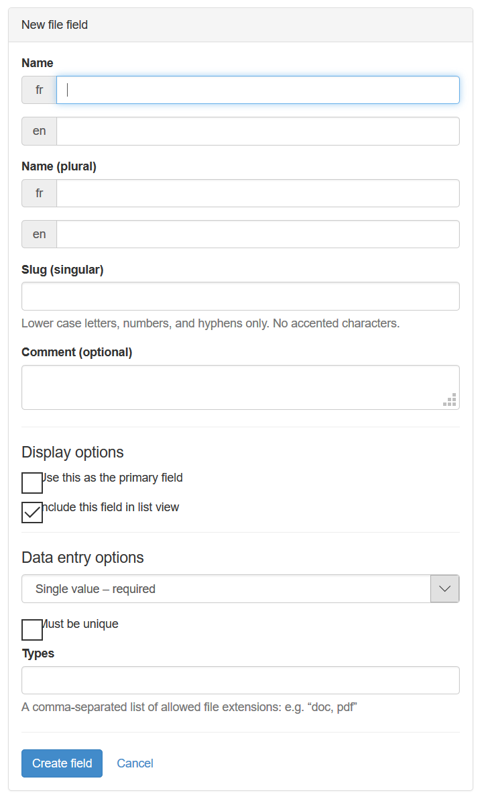

* Le **nom** du nouveau champ ‘fichier’ en langue primaire, mais aussi traduit dans les langues secondaires ;
* La **version plurielle** du nom dans toutes les langues ;
* Un **slug** au singulier est aussi requis pour chaque nouveau champ. Comme vous le savez déjà, il s’agit de choisir la partie d'une URL qui viendra se placer à la fin de l’URL générale de votre catalogue. Petit conseil : choisissez une version simplifiée du nom donné à ce champ. Rappel :  le slug doit être composé uniquement de caractères minuscules (sans accent), de nombres et de tirets. Si le slug souhaité a déjà été attribué, un message d’erreur apparaît et il faudra en choisir un autre ;
* Un **commentaire** optionnel peut être intégré ;
  *Un paramétrage pour les **options d’affichage** ("*Display options*") : vous cochez cette case si vous souhaitez utiliser le champ comme champ primaire ("*primary field*") ou non, autrement dit si vous voulez que ce champ soit celui qui définisse l’ordre alphabétique de tous les champs qui forment votre objet. Par conséquent, cette option n’est réalisable que pour un unique champ de votre objet. Une fois cochée pour un champ, il ne vous sera plus possible de la sélectionner lors de la création des champs suivants. Vous pouvez aussi choisir si vous désirez ou non que ce champ soit visible dans la liste des données lorsque vous vous trouvez dans la rubrique "*Data*".
>_Pour plus d’information sur la partie "Data", référez-vous à la section "[Data, explications](#data-explications)"._ 

* Un paramétrage pour les **options d’entrée** ("*Data entry options*") : vous sélectionnez dans la liste déroulante l’option qui va paramétrer le nombre de données possibles pour ce champ.
  CATIMA vous propose les choix suivants : "*Single value – optional*", "*Single value – required*". Autrement dit, vous pouvez choisir si une ‘donnée fichier’ est obligatoire ou optionnelle.
* "*Must be unique*" : cette option vous permet d’ordonner ou non à CATIMA de bien vérifier que chacune des données soit **unique**, c’est-à-dire qu’aucune donnée saisie ne soit identique à celles déjà entrées dans le catalogue.
* "*Types*": grâce ce paramètre, vous pouvez indiquer quels **types de fichiers** CATIMA acceptera pour ce champ. Vous indiquez les extensions sous forme d’une liste où chacune d’entre elles est séparée par des virgules. Donc lors de l’ajout de données dans votre catalogue, seuls les fichiers ayant un type indiqué dans votre liste pourront être ajoutés à ce champ.

#### Champ 'image' (Image field) 

Ici, vous paramétrez un champ pour des données qui seront entrées uniquement sous forme d’**images**, autrement dit : des données ayant des extensions telle que "png" ou "jpg", etc. À vous d‘entrer les informations suivantes : (vous remarquerez que pour chaque type de champ, la démarche reste majoritairement identique à celle des autres champs !)

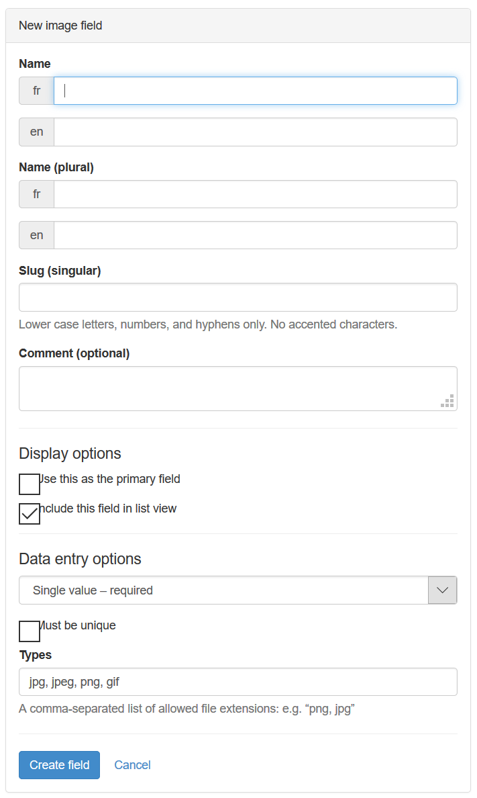

* Le **nom** du nouveau champ ‘image’ en langue primaire, mais aussi traduit dans les langues secondaires ;
* La **version plurielle** du nom dans toutes les langues ;
* Un **slug** au singulier est aussi requis pour chaque nouveau champ. Comme vous le savez déjà, il s’agit de choisir la partie d'une URL qui viendra se placer à la fin de l’URL générale de votre catalogue. Petit conseil : choisissez une version simplifiée du nom donné à ce champ. Rappel :  le slug doit être composé uniquement de caractères minuscules (sans accent), de nombres et de tirets. Si le slug souhaité a déjà été attribué, un message d’erreur apparaît et il faudra en choisir un autre ;
* Un **commentaire** optionnel peut être intégré ;
* Un paramétrage pour les **options d’affichage** ("*Display options*") : vous cochez cette case si vous souhaitez utiliser le champ comme champ primaire ("*primary field*") ou non, autrement dit si vous voulez que ce champ soit celui qui définisse l’ordre alphabétique de tous les champs qui forment votre objet. Par conséquent, cette option n’est réalisable que pour un unique champ de votre objet. Une fois cochée pour un champ, il ne vous sera plus possible de la sélectionner lors de la création des champs suivants. Vous pouvez aussi choisir si vous désirez ou non que ce champ soit visible dans la liste des données lorsque vous vous trouvez dans la rubrique "*Data*".
>_Pour plus d’information sur la partie "Data", référez-vous à la section "[Data, explications](#data-explications)"._

* Un paramétrage pour les **options d’entrée** ("*Data entry options*") : vous sélectionnez dans la liste déroulante l’option qui va paramétrer le nombre de données possibles pour ce champ. CATIMA vous propose les choix suivants : "*Single value – optional*" ou "*Single value – required*". Autrement dit, vous pouvez choisir si une donnée est obligatoire ou optionnelle pour ce champ.
* "*Must be unique*" : cette option vous permet d’ordonner ou non à CATIMA de bien vérifier que chacune des données soit **unique**, c’est-à-dire qu’aucune donnée saisie ne soit identique à celles déjà entrées dans le catalogue. 
* "*Types*" : grâce ce paramètre, vous pouvez indiquer quels types d’images CATIMA acceptera pour ce champ. Vous indiquez les extensions sous forme d’une liste où chacune d’entre elles est séparée par des virgules. Donc lors de l’ajout de données dans votre catalogue, seuls les images ayant un type indiqué dans votre liste pourront être ajoutées à ce champ.

####Champ 'd'entier' (Int field)

Ici, vous paramétrez un champ pour des données qui seront entrées uniquement sous forme numérique, autrement dit des **nombres entiers** (donc n’ayant rien après la virgule). CATIMA vous demande d‘entrer les informations suivantes : (vous remarquerez que pour chaque type de champ, la démarche est presque identique !)

* Le **nom** du nouveau champ ‘d’entiers’ en langue primaire, mais aussi traduit dans la/les langue(s) secondaire(s) ;
* La **version plurielle** du nom dans toutes les langues ;
* Un **slug** au singulier est aussi requis pour chaque nouveau champ. Comme vous le savez déjà, il s’agit de choisir la partie d'une URL qui viendra se placer à la fin de l’URL générale de votre catalogue. Petit conseil : choisissez une version simplifiée du nom donné à ce champ. Rappel :  le slug doit être composé uniquement de caractères minuscules (sans accent), de nombres et de tirets. Si le slug souhaité a déjà été attribué, un message d’erreur apparaît et il faudra en choisir un autre ;
* Un commentaire optionnel peut être intégré ;
* Un paramétrage pour les **options d’affichage** ("*Display options*") : vous cochez cette case si vous souhaitez utiliser le champ comme champ primaire ("*primary field*") ou non, autrement dit si vous voulez que ce champ soit celui qui définisse l’ordre alphabétique de tous les champs qui forment votre objet. Par conséquent, cette option n’est réalisable que pour un unique champ de votre objet. Une fois cochée pour un champ, il ne vous sera plus possible de la sélectionner lors de la création des champs suivants. Vous pouvez aussi choisir si vous désirez ou non que ce champ soit visible dans la liste des données lorsque vous vous trouvez dans la rubrique "*Data*".
>_Pour plus d’information sur la partie "Data", référez-vous à la section "[Data, explications](#data-explications)"._

* Un paramétrage pour les **options d’entrée** ("*Data entry options*") : vous sélectionnez dans la liste déroulante l’option qui va paramétrer le nombre de données possibles pour ce champ.
  CATIMA vous propose les choix suivants : "*Single value – optional*", "*Single value – required*". Autrement dit, vous allez pouvoir choisir si une ‘donnée décimale’ est obligatoire ou optionnelle.
* "*Must be unique*" : cette option vous permet d’ordonner ou non à CATIMA de bien vérifier que chacune des données soit **unique**, c’est-à-dire qu’aucune donnée saisie ne soit identique à celles déjà entrées dans le catalogue. 
* "*Minimum value*" : cette option est facultative. Elle vous permet de donner à CATIMA une **valeur minimale** d’entrées pour ce champ. Dans le cas où les données que vous entrerez par la suite dans ce champ sont plus petites que le seuil enregistré, elles seront refusées.
* "*Maximum value*" : cette option est aussi facultative. Elle vous permet de donner à CATIMA une **valeur maximale** d’entrée pour ce champ. Si, par la suite, les données que vous entrerez dans ce champ sont plus élevéesque le seuil enregistré, elles seront refusées. 
* "*Default value*" : ici, vous pouvez décider d’une **valeur par défaut** pour chaque nouvelle donnée ne portant pas d’information pour ce champ. Cependant, si la donnée que vous ajoutez possède déjà une information de type décimal à cet endroit, elle viendra remplacer la valeur par défaut. De cette manière, vous vous assurez de toujours avoir une valeur dans ce champ.
* "*Auto increment*": Si vous cochez cette case, CATIMA créera une **numérotation automatique**: chaque valeur sera incrémentée de 1 par rapport à la valeur précédente.

À la fin, soit vous enregistrez votre champ ‘d’entiers’ et les différents paramètres que vous pouvez modifier sans problème par la suite, soit vous annulez en cliquant sur "*Cancel*".

#### Champ 'référence' (Reference field)

Depuis ce type de champ, vous pouvez paramétrer un champ faisant directement référence à un des **objets** (*items*) existants dans votre catalogue. Vous liez donc un objet à un champ. CATIMA vous demande d‘entrer les informations suivantes :

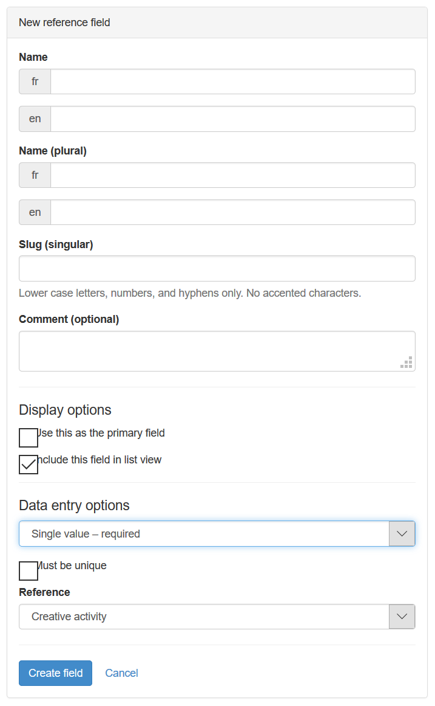

* Le **nom** du nouveau champ ‘référence’ en langue primaire, mais aussi traduit dans les langues secondaires;
* La **version plurielle** du nom dans toutes les langues ;
* Un **slug** au singulier est aussi requis pour chaque nouveau champ. Comme vous le savez déjà, il s’agit de choisir la partie d'une URL qui viendra se placer à la fin de l’URL générale de votre catalogue. Petit conseil : choisissez une version simplifiée du nom donné à ce champ. Rappel :  le slug doit être composé uniquement de caractères minuscules (sans accent), de nombres et de tirets. Si le slug souhaité a déjà été attribué, un message d’erreur apparaît et il faudra en choisir un autre ;
* Un **commentaire** optionnel peut être intégré ;
* Un paramétrage pour les **options d’affichage** ("*Display options*") : vous cochez cette case si vous souhaitez utiliser le champ comme champ primaire ("*primary field*") ou non, autrement dit si vous voulez que ce champ soit celui qui définisse l’ordre alphabétique de tous les champs qui forment votre objet. Par conséquent, cette option n’est réalisable que pour un unique champ de votre objet. Une fois cochée pour un champ, il ne vous sera plus possible de la sélectionner lors de la création des champs suivants. Vous pouvez aussi choisir si vous désirez ou non que ce champ soit visible dans la liste des données lorsque vous vous trouvez dans la rubrique "*Data*".
>_Pour plus d’information sur la partie "Data", référez-vous à la section "[Data, explications](#data-explications)"._

* Un paramétrage pour les **options d’entrée** ("*Data entry options*") : vous sélectionnez dans la liste déroulante l’option qui va paramétrer le nombre de données possibles pour ce champ. CATIMA vous propose les choix suivants :
  "*Single value – optional*", "*Single value – required*", "*Multiple values – optional*" ou "*Multiple values – required*"
  Autrement dit, vous pouvez choisir si une ‘donnée référence’ est obligatoire ou optionnelle et s’il doit y en avoir une seule ou si vous pouvez en entrer plusieurs dans un même champ.
* "*Must be unique*" : cette option vous permet d’ordonner ou non à CATIMA de bien vérifier que chacune des données soit **unique**, c’est-à-dire qu’aucune donnée saisie ne soit identique à celle déjà entrées dans le catalogue.
* "*Reference*" : c’est depuis cette liste déroulante que vous pouvez paramétrer votre champ et faire **référence à l’objet** souhaité. Pour faire cela, il faut juste sélectionner celui que vous avez choisi.

####Champ ‘texte’ ou (Text field)

Ici, vous paramétrez un champ pour des données qui seront entrées uniquement sous forme de **texte**, autrement dit, uniquement des lettres et autres caractères de ponctuation. CATIMA vous demande les informations suivantes :

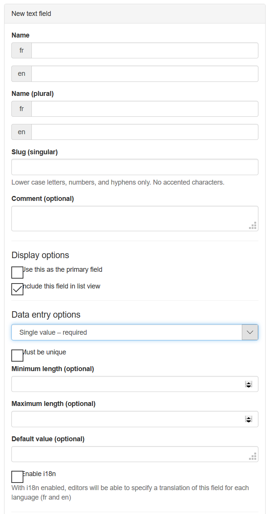

* Le **nom** du nouveau champ ‘texte’ en langue primaire, mais aussi traduit dans les langues secondaires;
* La **version plurielle** du nom dans toutes les langues ;
* Un **slug** au singulier est aussi requis pour chaque nouveau champ. Comme vous le savez déjà, il s’agit de choisir la partie d'une URL qui viendra se placer à la fin de l’URL générale de votre catalogue. Petit conseil : choisissez une version simplifiée du nom donné à ce champ. Rappel :  le slug doit être composé uniquement de caractères minuscules (sans accent), de nombres et de tirets. Si le slug souhaité a déjà été attribué, un message d’erreur apparaît et il faudra en choisir un autre ;
* Un **commentaire** optionnel peut être intégré ;
* Un paramétrage pour les **options d’affichage** ("*Display options*") : vous cochez cette case si vous souhaitez utiliser le champ comme champ primaire ("*primary field*") ou non, autrement dit si vous voulez que ce champ soit celui qui définisse l’ordre alphabétique de tous les champs qui forment votre objet. Par conséquent, cette option n’est réalisable que pour un unique champ de votre objet. Une fois cochée pour un champ, il ne vous sera plus possible de la sélectionner lors de la création des champs suivants. Vous pouvez aussi choisir si vous désirez ou non que ce champ soit visible dans la liste des données lorsque vous vous trouvez dans la rubrique "*Data*".
>_Pour plus d’information sur la partie "Data", référez-vous à la section "[Data, explications](#data-explications)"._

* Un paramétrage pour les **options d’entrée** ("*Data entry options*") : vous sélectionnez dans la liste déroulante l’option qui va paramétrer le nombre de données possibles pour ce champ.
  CATIMA vous propose les choix suivants : "*Single value – optional*", "*Single value – required*". Autrement dit, vous allez pouvoir choisir si une donnée est obligatoire ou optionnelle.
* "*Must be unique*" : cette option vous permet d’ordonner ou non à CATIMA de bien vérifier que chacune des données soit **unique**, c’est-à-dire qu’aucune donnée saisie ne soit identique à celles déjà entrées dans le catalogue. 
* "*Minimum length*" : cette option est facultative. Elle vous permet de donner à CATIMA une **longueur minimale** d’entrées pour ce champ. Dans le cas où les données que vous entrez par la suite dans ce champ sont plus courtes que le seuil enregistré, elles seront refusées.
* "*Maximum length*" : cette option est aussi facultative. Elle vous permet de donner à CATIMA une **longueur maximale** d’entrée pour ce champ. Si, par la suite, les données que vous entrez dans ce champ sont plus longues que le seuil enregistré, elles seront refusées. 
* "*Default value*" : ici, vous pouvez décider d’une **information par défaut** pour chaque nouvelle donnée ne portant pas d’information pour ce champ. Cependant, si la donnée que vous ajoutez possède déjà une information de type texte à cet endroit, elle viendra remplacer celle qui s’affiche par défaut. De cette manière, vous vous assurez de toujours avoir une information dans ce champ.

* "*Enable i18n*"
  * *à compléter*

Au final, soit vous enregistrez votre champ ‘texte’ et les différents paramètres que vous pouvez modifier sans autre par la suite, soit vous annulez en cliquant sur "*Cancel*".

#### Champ 'Lien URL' (URL field)

Ici, vous paramétrez un champ pour des données qui seront entrées uniquement sous **forme de liens**, autrement dit des URLs. Il vous faut donc entrer les informations suivantes :

* Le **nom** du nouveau champ ‘lien URL’ en langue primaire, mais aussi traduit dans les langues secondaires;
* La **version plurielle** du nom dans toutes les langues ;
* Un **slug** au singulier est aussi requis pour chaque nouveau champ. Comme vous le savez déjà, il s’agit de choisir la partie d'une URL qui viendra se placer à la fin de l’URL générale de votre catalogue. Petit conseil : choisissez une version simplifiée du nom donné à ce champ. Rappel :  le slug doit être composé uniquement de caractères minuscules (sans accent), de nombres et de tirets. Si le slug souhaité a déjà été attribué, un message d’erreur apparaît et il faudra en choisir un autre ;
* Un **commentaire** optionnel peut être intégré ;
* Un paramétrage pour les **options d’affichage** ("*Display options*") : vous cochez cette case si vous souhaitez utiliser le champ comme champ primaire ("*primary field*") ou non, autrement dit si vous voulez que ce champ soit celui qui définisse l’ordre alphabétique de tous les champs qui forment votre objet. Par conséquent, cette option n’est réalisable que pour un unique champ de votre objet. Une fois cochée pour un champ, il ne vous sera plus possible de la sélectionner lors de la création des champs suivants. Vous pouvez aussi choisir si vous désirez ou non que ce champ soit visible dans la liste des données lorsque vous vous trouvez dans la rubrique "*Data*".
>_Pour plus d’information sur la partie "Data", référez-vous à la section "[Data, explications](#data-explications)"._

* Un paramétrage pour les **options d’entrée** ("*Data entry options*") : vous sélectionnez dans la liste déroulante l’option qui va paramétrer le nombre de données possibles pour ce champ.
  CATIMA vous propose les choix suivants : "*Single value – optional*", "*Single value – required*". Autrement dit, vous allez pouvoir choisir si une donnée est obligatoire ou optionnelle.
* "*Must be unique*": cette option vous permet d’ordonner ou non à CATIMA de bien vérifier que chacune des données soit **unique**, c’est-à-dire qu’aucune donnée saisie ne soit identique à celles déjà entrées dans le catalogue. 
* "*Default value*" : ici, vous pouvez décider d’une **URL par défaut** pour chaque nouvelle donnée ne portant pas d’information pour ce champ. Il faut l’écrire sous de manière complète, sans oublier la partie "http". Par la suite, si la donnée que vous ajoutez possède déjà une URL à cet endroit, elle viendra remplacer celle donnée ici par défaut. De cette manière, vous vous assurez de toujours avoir une information dans ce champ.
* "*Enable i18n*" :
  * *à compléter*

### Rubrique "Category"

Pour ajouter une **catégorie** (*category*), il faut toujours procéder de la même manière : cliquez sur "*+ New category*" en bas de la rubrique "*Categories*", dans la barre de gauche. La liste suivante s’affiche :

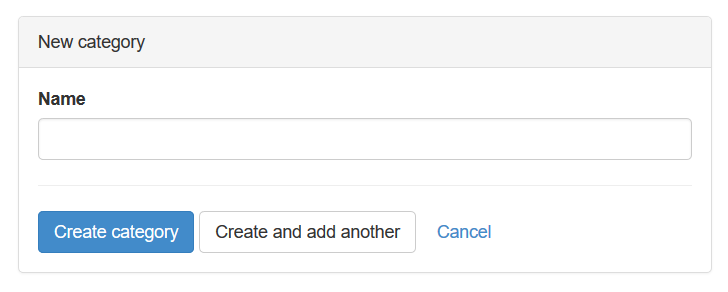

Vous remarquerez que CATIMA vous demande beaucoup moins d’informations que pour la création des objets.
Pour l’ajout d’une nouvelle catégorie, on vous demande simplement d‘entrer le **nom** en langue primaire que vous souhaitez lui donner.

Pour enregistrer, il faut cliquer sur "*Create category*". De façon analogue à l’enregistrement d’un objet (*item*), la catégorie, créée à l’instant, va apparaître dans la barre de gauche dans la rubrique "*Categories*". Si vous souhaitez enregistrer votre catégorie et en ajouter une autre, vous avez aussi la possibilité de cliquer sur "*Create and add another*", CATIMA va donc directement vous ouvrir une nouvelle liste à remplir pour une nouvelle catégorie. 

À tout moment, vous pouvez annuler en cliquant sur "*Cancel*".

### Paramétrage d'une catégorie

Une fois que les catégories ont été créées, il faut les **paramétrer**, autrement dit: leur donner une forme. Pour faire ceci, vous allez procéder exactement comme pour les objets (*items*), c'est-à-dire que vous devez sélectionner la catégorie souhaitée dans la barre de gauche. Vous verrez apparaitre les informations suivantes :

Remarquez que le **nom** de la catégorie est indiqué dans la ligne grise. Vous pouvez sans autre changer cette information en cliquant sur "*Edit category*", affiché en bleu, sur la droite.
Sur la ligne juste en-dessous, vous pouvez voir les en-têtes suivants : "*Position*", "*Slug*", "*Name*", "*Type*", "*Required ?*", "*List view ?*". 
La structure des champ d’une catégorie est exactement identique à celle des champ d’un objet. Cette partie sera **complétée automatiquement** par CATIMA et fera sens dès que vous aurez paramétré des champs. En ajoutant un champ, les paramètres que vous allez choisir et enregistrer vont ensuite s’afficher sur cette page sous la forme d’une petite liste récapitulative. Les différentes colonnes seront remplies selon les options que vous aurez ordonnées et seront à tout moment modifiables.
Maintenant, il va falloir ajouter des **champs** à votre catégorie. Cela est réalisable grâce à la liste déroulant"*+ Add…*". Tout un choix s’offre à vous :

Chacun de ces champs est une information qui va paramétrer votre catégorie. Chaque champ est de type différent et ne permettra donc qu’un unique format d’information.
C’est grâce aux champs des catégories que vous allons pouvoir trier vos données et faire des liens entre toutes les informations qui composent votre catalogue, mais surtout d'étendre les caractéristiques d'un objet de manière flexible.
Vous retrouverez tous les types de champs qui sont proposés dans cette liste déroulante ainsi que des explications les concernant plus haut dans ce mode d’emploi.

> *Veuillez-vous référer aux différentes rubriques sur les champs dans la section "[Paramétrage d'un objet](#paramétrage-dun-objet-item)".*

###Rubrique "Choice"

Pour ajouter un **ensemble de choix** (*choices set*), il faut procéder de la manière suivante : sélectionner "*Choices*" dans la barre de gauche, vous arriverez directement sur la liste récapitulative de tous les ensembles que vous avez créés et enregistrés :

Pour en ajouter, il faut donc cliquer sur "*+ New choice set*" qui s’affiche en bleu, à droite dans la ligne grise. 
Sur la ligne juste en-dessous, vous remarquerez les en-têtes suivants : "*Name*", "*Status*" et "*Choices*".
La structure des ensembles est donc résumée ici. Cette partie sera **complétée automatiquement** par CATIMA dès que vous enregistrez un nouveau set de choix. Les différentes colonnes seront remplies selon les options que vous aurez ordonnées et seront à tout moment modifiables. Vous remarquerez que le nom général du set vous est présenté, ainsi que les choix qui y sont contenus.
Maintenant, revenons-en à l’**ajout** d’un ensemble de choix, après avoir cliqué sur  "*+ New choice set*", la page de paramétrages suivante apparait :

CATIMA vous demande beaucoup moins d’informations que pour la création des objets par exemple.
Pour cet ajout, il vous faut entrer un **nom** général pour cet ensemble. Ensuite, vous cliquez sur "*+ Add choice*" et vous entrez le mot de l'ensemble de choix. En général, ce sont des mots-clés que vous allez utiliser dans les ensembles. Pour chaque mot, CATIMA vous demande la **version courte** ("*short name*"), autrement dit le mot essentiel. Si besoin, en option, vous pouvez ajouter une **version plus longue** ("*long name*") et si souhaité, vous avez aussi la possibilité de faire un lien direct avec une catégorie spécifique, déjà existante dans votre catalogue. Nous ajoutons donc à notre ensemble autant de mots désirés.
Pour **enregistrer**, il faut cliquer sur "*Create choice set*". De façon analogue à l’enregistrement d’un objet (*item*) ou d’une catégorie (*category*), l'ensemble de choix créé à l’instant va directement s’ajouter à la liste que vous pouvez consulter en cliquant sur "*Choices*" dans les rubriques de gauche. Si vous souhaitez enregistrer votre ensemble de choix et en ajouter un autre, vous avez aussi la possibilité de cliquer sur "*Create and add another*", CATIMA va donc directement vous ouvrir une nouvelle liste à remplir pour un nouvel ensemble. À tout moment, vous pouvez annuler en cliquant sur "*Cancel*".

###Rubrique "Pages"
Pour ajouter une **page**, il faut procéder de la manière suivante : vous allez sélectionner "*Pages*" dans la barre de gauche et CATIMA vous fait directement arriver sur la liste récapitulative de toutes les pages que vous possédez dans votre catalogue :

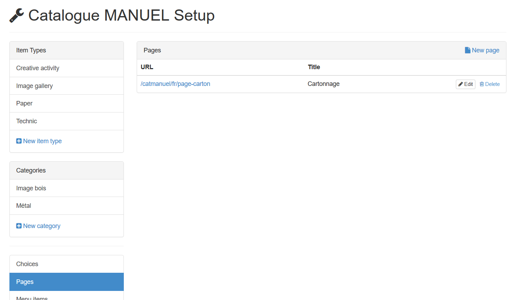

Sur la ligne juste en-dessous, vous pouvez voir les en-têtes suivants : "*URL*" et "*Title*". Ainsi, vous pouvez rapidement trouver une page selon son titre et cliquer sur "*Edit*" pour la modifier. Cette partie sera complétée automatiquement par CATIMA dès que vous enregistrez une nouvelle page pour votre catalogue.
Maintenant, comment ajouter une **nouvelle page**? L’intérêt avec cet outil, c’est que vous pouvez décider exactement de la mise en page de la page qui sera consultée par l’utilisateur lors que sa visite sur le catalogue. En général, c’est CATIMA qui organise le site de votre catalogue. 

>*Vous pouvez avoir plus d’information à ce sujet en consultant la rubrique "[Menu items](#rubrique-menu-items)".*

Donc pour ajouter une nouvelle page, il faut donc cliquer sur "*+ New page*" qui s’affiche en bleu, à droite dans la ligne grise. La page de paramétrage suivante apparait :

 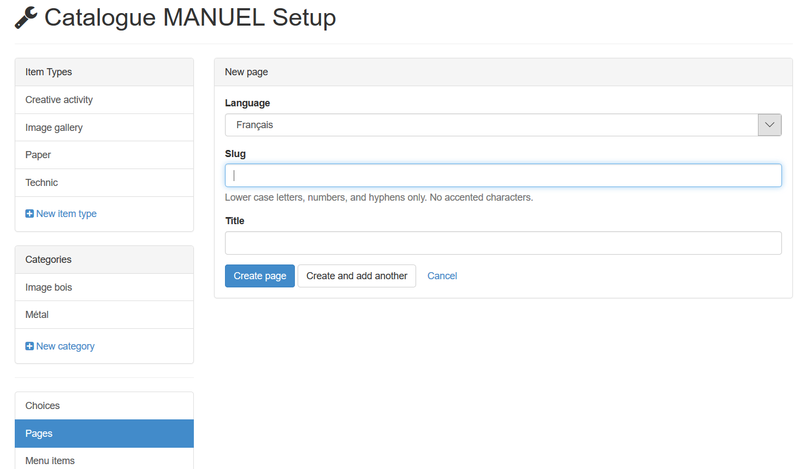 

Vous devez choisir la **langue** de votre page grâce aux propositions que vous fait la liste déroulante.
Un **slug** au singulier est aussi requis. Comme vous l’avez déjà vu précédemment, c’est la partie d'une URL qui viendra se placer à la fin de l’URL générale de votre catalogue. Il doit être composé uniquement de caractères minuscules (sans accent), de nombres et de tirets.
Et pour finir, il faut choisir un **titre** (*title*) que vous souhaitez donner à votre page.  Une fois cela fait, il faut enregistrer en cliquant sur "*Create page*". De façon analogue à l’enregistrement d’un ensemble de choix, la page créée à l’instant va directement être ajoutée à la liste que vous retrouvez en cliquant sur "*Pages*" dans les rubriques de gauche. Si vous souhaitez enregistrer votre page et directement en ajouter une autre, vous avez aussi la possibilité de cliquer sur "*Create and add another*", CATIMA va donc directement vous ouvrir une nouvelle liste à remplir pour une nouvelle page. À tout moment, vous pouvez annuler en cliquant sur "*Cancel*".

### Paramétrage d'une page 
Une fois que la page a été créée, il faut la **paramétrer**, autrement dit : choisir sa forme. Pour faire ceci, vous devez retourner sur la page principale "*Pages*", donc en sélectionnant "*Pages*" dans la barre de gauche. La liste récapitulative de toutes les pages s’affiche. Vous cliquez ensuite sur "*Edit*" qui se trouve sur la même ligne que la page à paramétrer. Vous voyez apparaitre les informations suivantes :

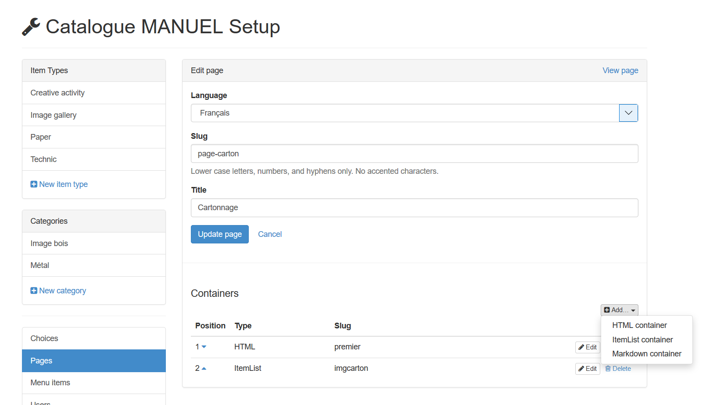

Vous remarquez que les trois premiers champs sont déjà remplis et récapitulent ce que vous aviez choisi lors de la création de la page. Cependant, une nouvelle section apparaît ici, celle nommée "**Containers**". Les petits numéros écrits sous "*Position*" définissent l’ordre dans lequel les différents "*containers*" apparaîtront sur la page. Si vous souhaitez les modifier, cliquez sur les petites flèches bleues pour les ordonner comme vous le souhaitez.
Ces "*containers*" sont en fait des parties différentes qui vont constituer l’ensemble de votre page. Trois types des parties sont possibles :

-	**HTML** : grâce à ce type, il vous est possible de créer un bout de page avec les outils qu’on utilise pour créer une page web. Vous pouvez y intégrer du texte, des images, des liens, etc.
   -**ItemList** : en choisissant ce type, vous demandez à CATIMA d’afficher le contenu d’un de vos objets sous forme de liste.
   -**Markdown** : ici, vous écrivez tout simplement du texte qui sera ensuite affiché sur votre page.

####Paramétrage d'un "HTML Container"

Grâce à ce type de container, vous pouvez créer un bout de **page web** avec les outils utilisés habituellement. 

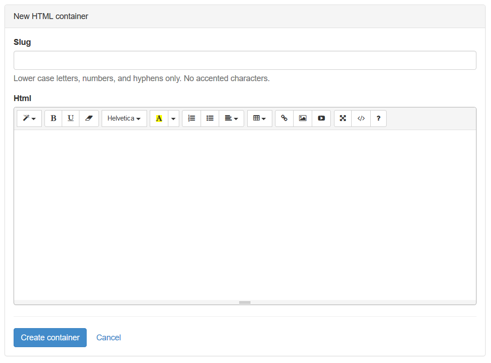

CATIMA vous demande de choisir un **slug**. Ce slug doit être au singulier et qu’il s’agit de la partie d'une URL qui viendra se placer à la fin de l’URL générale de votre catalogue. Petit conseil : choisissez une version simplifiée du nom donné à ce champ. Rappel :  le slug doit être composé uniquement de caractères minuscules (sans accent), de nombres et de tirets. Si le slug souhaité a déjà été attribué, un message d’erreur apparaît et il faudra en choisir un autre.
Ensuite, vous remarquerez qu’une **fenêtre** est à votre disposition. Vous pouvez y déposer votre texte, vos images, vos liens, etc. Des outils spécifiques sont affichés dans la barre d’en-tête de cette section. Voici comment ils fonctionnent, ils ressemblent aux outils trouvés dans d'autres logiciels de traitement de texte :

 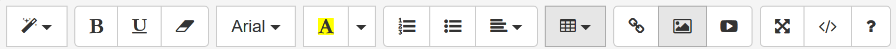

-	La baguette magique permet de choisir la **taille des titres** ou en-têtes ;
   -B et U : **gras** ou **souligné** ;
   -La gomme : elle permet d’enlever directement toutes modifications faites à la couleur, police, style, etc. appliqués à l’écriture de départ. C’est une façon rapide de retrouver les **éléments de départ** ;
   -L’élément suivant vous propose diverses **polices** ; 
   -Vous pouvez ensuite aussi modifier la **couleur du texte** ou celle du **fond** ;
   -Vous avez ensuite les outils de **numérotation**, de **puces** ou d’**alignement** ;
   -Le **tableau** : vous pouvez insérer des lignes ou des colonnes ;
   -Les trois outils suivants vont permettent d'insérer soit un **lien**, soit une **image**, soit une **vidéo** ;
   -En cliquant sur les flèches, vous pourrez travailler en mode **plein écran** ;
   -L'avant-dernier outil vous montre la version en **code** de votre page HTML ;
*  ? : vous trouverez quelques informations supplémentaires sur les **raccourcis clavier**.

Une fois que vous avez fait et mis en page votre page HTML, il vous faut l'**enregistrer** en cliquant sur "*Create container*". Vous vous retrouverez à nouveau dans les paramétrages de votre page et pourrez directement créer d'autres containers. Une page peut être composée de plusieurs containers de types différents. 

 

Vous remarquerez la colonne "*Position*". Grâce aux petites flèches bleues qui s'affichent juste en dessous, vous pouvez définir l'**ordre** d'apparition de vos containers.
Afin de tout **sauvegarder** quand vous êtes satisfaits de vos containers et de leur ordre, n'oubliez pas de cliquer sur "*Update page*".

####Paramétrage d’un "ItemList Container"
Avec ce type de *containers*, il vous sera possible d'afficher sur votre page tout le contenu d'un de vos objets.

 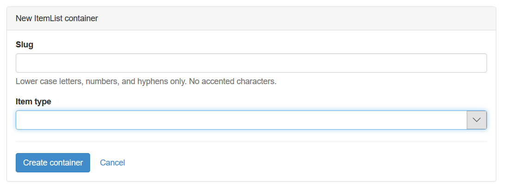

CATIMA vous demande de choisir un **slug**. Ce slug doit être au singulier et qu’il s’agit de la partie d'une URL qui viendra se placer à la fin de l’URL générale de votre catalogue. Petit conseil : choisissez une version simplifiée du nom donné à ce champ. Rappel :  le slug doit être composé uniquement de caractères minuscules (sans accent), de nombres et de tirets. Si le slug souhaité a déjà été attribué, un message d’erreur apparaît et il faudra en choisir un autre.
Ensuite, vous choisissez l'objet que vous souhaitez faire afficher sous forme de **liste**. Normalement, tous les objets que vous avez créés et enregistrés seront présents dans la liste déroulante que CATIMA met à votre disposition.
Il vous faut enregistrer en cliquant sur "*Create container*". Vous vous retrouverez à nouveau dans les paramétrages de votre page et pourrez directement créer d'autres containers. Vous pouvez aussi modifier l'ordre d'apparition de vos containers grâce aux petites flèches bleues qui s'affichent juste en dessous de "*Position*". À la fin, n'oubliez pas de cliquer sur "*Update page*".

####Paramétrage d’un "Markdown Container"
Avec ce type de containers, il vous sera possible d'afficher un texte simple.

 

CATIMA vous demande de choisir un **slug**. Ce slug doit être au singulier et qu’il s’agit de la partie d'une URL qui viendra se placer à la fin de l’URL générale de votre catalogue. Petit conseil : choisissez une version simplifiée du nom donné à ce champ. Rappel :  le slug doit être composé uniquement de caractères minuscules (sans accent), de nombres et de tirets. Si le slug souhaité a déjà été attribué, un message d’erreur apparaît et il faudra en choisir un autre.
Ensuite, vous ajoutez votre **texte** dans la fenêtre prévue pour cet effet. Une fois que c'est fait, enregistrez en cliquant sur "*Create container*". Vous vous retrouverez à nouveau dans les paramétrages de votre page et pourrez directement créer d'autres containers. Vous pouvez aussi modifier l'ordre d'apparition de vos containers grâce aux petites flèches bleues qui s'affichent juste en dessous de "*Position*". À la fin, n'oubliez pas de cliquer sur "*Update page*".

###Rubrique "Menu items"
Depuis cette rubrique, vous pouvez **organiser la présentation** de votre site que CATIMA crée à partir de votre catalogue. CATIMA utilise, par défaut, vos objets comme onglets et les classe par ordre alphabétique. Si vous souhaitez changer et réorganiser vous-même le contenu de vos onglets, il vous faut ajouter et paramétrer des menus en cliquant sur "*+ New menu item*".  

 

La page suivante s'affiche et plusieurs choix s'offrent à vous, vous pouvez créer 4 types de menus différents :

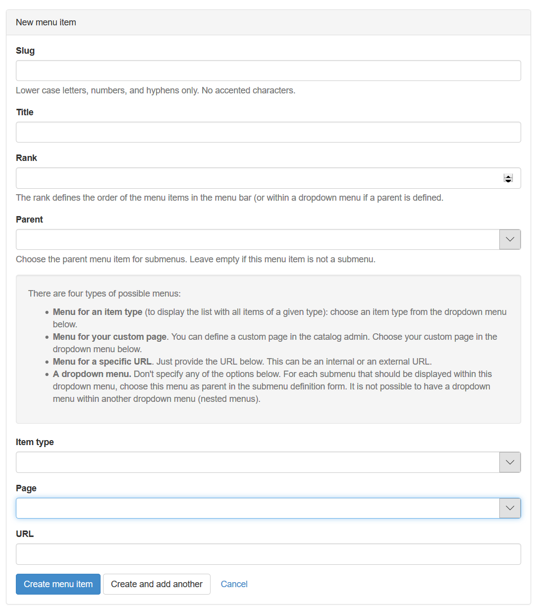

- Tout d'abord, CATIMA vous demande de choisir un **slug** au singulier. Petit conseil : choisissez une version simplifiée du nom donné à ce champ. Rappel :  le slug doit être composé uniquement de caractères minuscules (sans accent), de nombres et de tirets. Si le slug souhaité a déjà été attribué, un message d’erreur apparaît et il faudra en choisir un autre.
  -Un **titre** vous est demandé, il s'agit de celui qui apparaître comme en-têtes de vos onglets sur le site.
  -Vous devez ensuite choisir un **rang**, autrement dit, c'est ici que vous allez indiquer à CATIMA l'ordre de vos menus dans la barre d'onglets du site. Il faut que vous définissiez leur rang de manière logique et croissante.

Les 4 champs que vous devez ensuite remplir vont chacun donner des caractéristiques particulières à vos menus.

Regardons de plus près les différents cas possibles :

- *Menu d'entête avec un onglet déroulant*: champ **parent** à remplir
  Vous ne devez pas remplir ce champ si votre menu est le titre principal de votre onglet. Par contre, si vous souhaitez créer un onglet déroulant, il vous faut choisir un objet "parent" que vous trouverez dans la liste déroulante. Donc le menu que vous êtes en train de paramétrer deviendra un sous-menu, il vous faudra faire pareil pour les autres sous-menus que vous désirez mettre dans votre onglet déroulant et donc leur attribuer le même objet "parent".
- *Menu d'entête avec un onglet correspondant à un objet provenant de la liste de nos objets (items)*: champ **item type** à remplir
  Grâce à la liste déroulante "*item type*", choisissez l'objet qui sera l'en-tête de l'onglet. Vous enregistrez et la page qui s'affichera sera le contenu de ce dernier si vous cliquez sur l'onglet en question.
- *Menu d'entête avec un onglet qui appelle une page que nous avons créée sous "Pages"*: champ page à remplir
  La démarche est la suivante : il vous faut lier l'onglet à la page souhaitée en la sélectionnant dans la liste déroulante "*Page*". En enregistrant, CATIMA présentera automatiquement la page que vous avez choisie lorsque l'utilisateur cliquera sur l'onglet correspondant.
- *Menu d'entête avec un onglet qui renvoie l'utilisateur directement vers un lien externe*: champ **URL** à remplir
  Complétez le champ nommé "*URL*". Vous écrivez l'URL complète du site ou de la page web que vous souhaitez ouvrir au premier clic sur l'onglet. CATIMA fera donc directement le lien vers cette adresse.

Une fois que votre choix est fait et que les bons champs sont remplis, il faut enregistrer en cliquant sur "*Create menu item*". Si vous souhaitez enregistrer votre menu et directement en ajouter un autre, vous avez aussi la possibilité de cliquer sur "*Create and add another*", CATIMA va donc directement vous ouvrir une nouvelle liste à remplir pour un nouveau menu. À tout moment, vous pouvez annuler en cliquant sur "*Cancel*".

----------

##Data, Explications

### Présentation
Jusqu'à maintenant vous avez travaillé dans le *Setup*, c'est-à-dire dans la partie "installation, mise en place" de votre catalogue. En cliquant sur "*Data*" dans la barre noire, tout en haut du navigateur, vous accédez à la partie "**données**", donc c'est depuis cet endroit que vous allez pouvoir remplir tous les objets (*items*) que vous avez paramétrés.
Vous allez arriver sur une page qui possède vos différents objets comme rubriques. Normalement, elles sont vides et se présentent ainsi :

###Explication
Pour remplir vos objets, deux possibilités s'offrent à vous :

- Soit vous importez vos données depuis un **fichier CSV** en sélectionnant l'option "*Import from CSV*".
  
  Une fois la sélection effectuée, CATIMA ouvre la page suivante et vous demande d'aller chercher votre fichier dans votre ordinateur et de le faire importer. 

- Soit vous remplissez manuellement chaque champ de vos objets avec les données correctes en cliquant sur "*+ New 'nom de votre objet'*". CATIMA va ensuite vous demander de remplir tous les champs que vous aviez formatés lors de l'élaboration de vos objets.
    
  Une fois que tous les champs seront remplis avec les données correctes et adéquates, vous pouvez enregistrer avec "*Create 'nom de votre objet'*". Si vous souhaitez enregistrer vos données et directement en ajouter d'autres, vous avez aussi la possibilité de cliquer sur "*Create and add another*". CATIMA va donc directement vous ouvrir une nouvelle liste à remplir. À tout moment, vous pouvez annuler en cliquant sur "Cancel".

Une fois que vos données sont enregistrées dans vos objets, elles vont apparaître sur la page d'accueil sous la forme d'une liste récapitulative.

C'est grâce à cette liste que le paramétrage pour les options d’affichage ("*Display options*") fait sens: vous aviez coché pour l'utilisation du champ comme champ primaire ("*primary field*") ou non; et si vous vouliez que ce champ soit visible ou non. C'est en quelque sorte l'inventaire de vos données qui affiche les informations comme vous les aviez paramétrées auparavant.

----------
##Faire un catalogue, Explications

###Comment commencer? 
Vous devez vous faire faire un compte **administrateur de catalogue** par un *administrateur système* car c'est uniquement lui peut créer un nouveau catalogue. Vous choisissez les informations suivantes : le nom de votre catalogue, le slug et ainsi que la langue primaire et les langues supplémentaires.
CATIMA supporte des __catalogues validés__ ou __non-validés__. Tant qu’un catalogue n’est pas validé par l’administrateur de système, il n’est pas visible dans la liste des catalogues existants qui apparait sur la page d’accueil de CATIMA. Dans ce cas, seuls les utilisateurs qui connaissent l’URL entière du catalogue en question peuvent y avoir accès, en l’insérant dans la barre de recherche du navigateur web. 
> *Si vous avez besoin de plus d'informations, référez-vous à la section : [Création d’un compte "administrateur de catalogue"](#création-dun-compte-administrateur-de-catalogue).*

###Quelle est l'étape suivante ?
Pour commencer, il vous faut faire un premier jet (un schéma conceptuel) de votre catalogue. Quels sont les éléments que vous souhaitez présenter et quelle structure désirez-vous leur donner.
L'idée est donc de réaliser un **schéma conceptuel** de ces objets et de lister les thèmes principaux qui en découlent. Le but est donc de définir les objets principaux de votre catalogue et de déjà réfléchir à sa structure. N'oubliez pas qu'avec CATIMA, vous partez de vos objets les plus spécifiques pour remonter ensuite vers les plus globaux. Vous construisez une **pyramide** en partant depuis la base.

Réalisons ensemble un **exemple** de catalogue. L'idée de ce dernier est de présenter un catalogue d'activités créatrices, autrement dit de bricolages réalisés par des élèves d'école secondaire et de les lier entre eux de manière logique.
Dans notre projet exemple, nous allons représenter les objets suivants :

|Travaux
|---
|Image 
|Nom du travail
|Description
|Niveau scolaire
|Date
|Couleurs
|Matière
|Type

|Techniques
|---
|Image
|Nom
|Information

|Activités créatives
|---
|Image
|Nom de la matière
|Information

|Instructions pour bricolages
|---
|Nom
|Croquis/Fichier
|Matière
|Technique

###Création de vos objets
Une fois que vous savez quels seront vos **objets principaux**, il vous faut les créer et paramétrer les champs qui les composent. Pour les ajouter, vous cliquez sur "*+ New Item Type*" en bas de la rubrique "*Item type*", dans la barre de gauche.
CATIMA vous demande le nom de l’objet en langue primaire, mais aussi dans les langues secondaires. Il vous faut aussi entrer le nom au pluriel et le slug. 
Cliquez sur "*Create item type*" pour enregistrer. Si vous souhaitez directement en ajouter un autre, vous avez aussi la possibilité de cliquer sur "*Create and add another*" et enchaîner avec la suite. À tout moment, vous pouvez annuler en cliquant sur "Cancel".
> *Si vous avez besoin de plus d'informations, référez-vous à la section : [Rubrique "Item Type"](#rubrique-item-type).*

Revenons-en à l'exemple de catalogue, les différents objets ont été créés. Vous pouvez les voir dans la liste qui s'affiche à gauche, sous "*Item Types*".

Le tableau qui apparaît au centre de la page est le **récapitulatif des champs** qui composent l'objet sélectionné (en bleu), ici "Travail en bois".
Donc pour vous aussi, la prochaine étape dans la création de votre catalogue est de paramétrer les champs que vous avez choisi de mettre dans la structure de vos objets. Vous remarquerez que chaque champ a un type différent. C'est à vous de choisir lequel correspond le mieux aux formats des données entrées par la suite.
> *Pour plus d'informations à ce sujet, référez-vous à la section : [Paramétrage d'un objet](#paramétrage-dun-objet-item).*

Quelques remarques qui pourraient vous intéresser : 

- Il vous faut être prêts à modifier à plusieurs reprises les champs de vos objets. Paramétrez d'abord vos objets avec les champs qui ne lient pas les objets entre eux. Faites d'abord ceux qui ne dépendent de rien car les liens entre objets se font grâce aux champs 'références', cependant si tous vos objets n'ont pas été complétés, il vous sera impossible d'y faire référence et par conséquent de les lier.
- Un conseil : définissez vos "*choices*" avant de faire un champ '*choice set*'. Rappelons que les '*choices*' nous permettent de limiter les données qui seront entrées puisque CATIMA vous proposera directement les mots qui ont été enregistrés dans votre '*choice*'.
  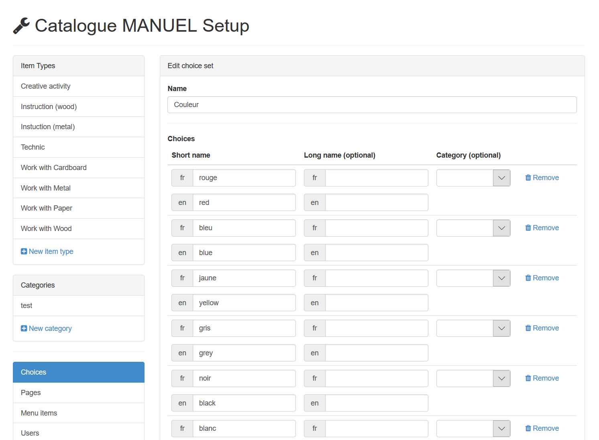
  Par exemple, pour notre exemple de catalogue, nous utilisons le '*choice*' pour les couleurs (cf. image). Nous l'avons créé avant de paramétrer notre champ '*choice set*' de l'objet en question. Ainsi nous pouvons ensuite directement faire le lien entre la liste des couleurs définies et l'objet. CATIMA vous prépare automatiquement des listes déroulantes dans lequel vous n'aurez plus qu'à sélectionner l'élément souhaité.
>*Pour plus d'informations, référez-vous à la section : [Rubrique : "Choice"](#rubrique-choice).*

- Utiliser le paramètre "Primary field" pour chaque objet différent est intéressant car vous pouvez choisir vous-même quel est le champ définissant l'ordre de vos données dans la partie *Data* ainsi que lors de leur affichage sur le site.

###Réalisation des liens entre objets
Une fois que vous avez formé tous vos objets et paramétré tous les champs qui les composent, il va falloir déterminer comment **lier les objets** entre eux. Rappelons que vous devez partir de l'objet le plus spécifique pour remonter vers ceux qui sont les plus globaux, généraux.
En observant le schéma conceptuel de l'exemple de catalogue qui se trouve juste un peu plus haut, vous remarquerez que certains des composants reviennent pour plusieurs d'entre eux. C'est grâce à ces **points communs** que vous allez pouvoir lier vos objets. Pour notre exemple, nous avons 'Technique' et 'Matière' qui vont assurer le rôle de lien entre différents objets. À vous de repérer ceux qui sont présents de votre cas de figure. Vous pouvez en avoir plus, tout dépend du contenu de votre catalogue.
Revenons à notre exemple de catalogue, pour lier un travail à une matière ou à une technique, nous avons utilisé le '*reference field*' .
>*Pour plus d'informations, référez-vous à la section : [Champ 'référence' ou "reference field"](#champ-référence-reference-field).*

Nous souhaitons lier un travail à une activité créatrice ainsi que ce même travail à une technique. Pour se faire il suffit d'ajout les champs 'référence' et de le paramétrer correctement en sélectionnant le bon objet dans la liste déroulante, comme dans l'exemple suivant :

Vous enregistrez et vous passez aux suivants. CATIMA fera tous les liens demandés entre les objets, vous le verrez mieux lorsque vous remplirez tous vos objets avec les données.
>*Pour plus d'informations, référez-vous à la section suivante : [Entrée des données](#entrée-des-données)*.

Quand vous aurez fait tous les liens nécessaires et si tout est correct, vous pourrez constater que les objets les plus spécifiques de votre catalogue seront ceux qui possèdent le plus de liens vers des objets plus généraux. En revanche, ceux généraux (tout en haut de la pyramide) seront ceux qui en possèdent le moins, voire même aucun. C'est pour cette raison que CATIMA diffère des bases de données pures et dures.
Dans notre catalogue, vous pouvez bien constatez cette hiérarchie en pyramide. Les objets généraux, à travers lesquels ils nous est possible de rejoindre les éléments les plus spécifiques, sont ceux qui ne possèdent aucun champ 'référence' vers d'autres objets.

Alors que l'objet le plus spécifique du catalogue, soit "Travaux", en possèdent aux moins deux (comme nous l'avons vu juste un peu plus haut).

###Entrée des données
Quand vous avez fini de faire les champs 'référence' entre vos objets et que vous avez réglé les derniers détails, vous allez pouvoir **remplir votre catalogue** avec des données. Pour faire cela, il faut passer du côté "*Data*".
Vous remarquerez tout de suite que tous vos objets sont listés dans la colonne de gauche. Ils sont tous vides, vous le voyez grâce un "0", écrit à côté de chacun de vos objets. Afin de les compléter avec vos données, cliquez sur "*+ New 'nom de l'objet'*" et remplissez les sections avec les bonnes informations ou alors importez vos fichiers CSV 
>*Pour plus d'informations, référez-vous à la section : [Data, Explications](#data-explications).*

Une fois que vos objets sont remplis, la partie "Data" de votre catalogue devrait ressembler à celle de notre exemple de catalogue :

En remplissant les sections des objets avec des données, vous pourrez vérifier que vos champs soient paramétrés correctement. Si vos champs 'référence', vos champs 'ensembles de choix' ou autres sont justes, CATIMA doit vous présenter les bonnes propositions dans ses listes déroulantes et ne vous laisser enter que les formats de données que vous choisis lors de la création de vos objets.

Vous pouvez constater que c'est bien le cas avec notre exemple de catalogue. Pour les sections '*choice*', CATIMA ne nous autorise que certains mots, autrement dit ceux que nous avions défini auparavant.
De plus, pour les liens de référence, CATIMA ne nous propose que des possibilités correspondant aux éléments contenus dans l'objet pointé grâce au champ 'référence'.
Notez encore que CATIMA vous affiche un message d'erreur et vous empêche d'enregistrer vos informations si une de vos données ne correspond pas au format prévu pour une section. Cette section s'affichera en rouge et vous devrez modifier votre information en conséquence.
N'oubliez pas d'enregistrer à chaque fois pour ne rien perdre. Remarquez qu'un enregistrement n'est possible que si toutes les sections ont été remplies.

###Création de pages 
Dans votre catalogue, vous pouvez aussi ajouter des **pages** que vous organisez vous-mêmes. CATIMA organise votre site en fonction des objets et des liens entre eux que vous avez paramétré. Grâce aux pages, vous allez pouvoir ajouter des textes ou réorganiser certains éléments de votre site. Pour plus d'informations à ce sujet, référez-vous à la section : Rubrique "Pages".
Vous pouvez comme dans l'exemple de catalogue, créer une **page complète** ayant le rôle d'une galerie d'images, autrement dit, vous pourrez y présenter toutes les images contenues dans les données de vos objets.
Pour ce faire, vous créez une page contenant uniquement des containers de type '*ItemList*'. Vous en mettez un pour chaque objet contenant les images que vous désirez afficher.
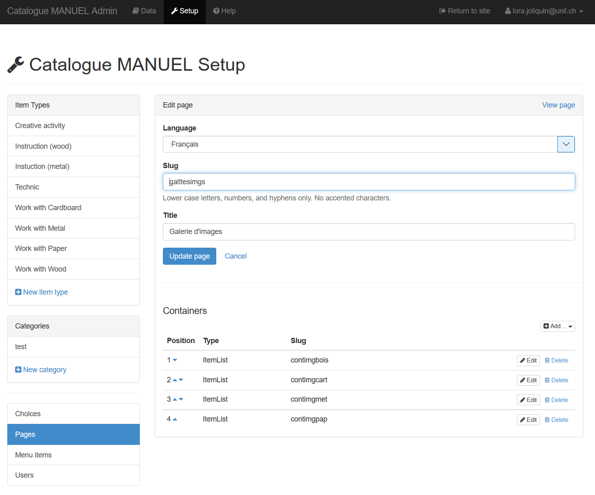
Si vous voulez voir le résultat directement depuis le site de votre catalogue, vous cliquez sur "*Return to site*".
>Attention: il faut que vous ayez mis votre page dans les réglages "*Menu items*" pour la voir s'afficher dans votre site, vous trouverez plus d'informations sous la section: [Rubrique "Menu Items"](#rubrique-menu-items).
>Dans notre exemple de catalogue, la page 'Galerie d'images' s'affiche ainsi :
>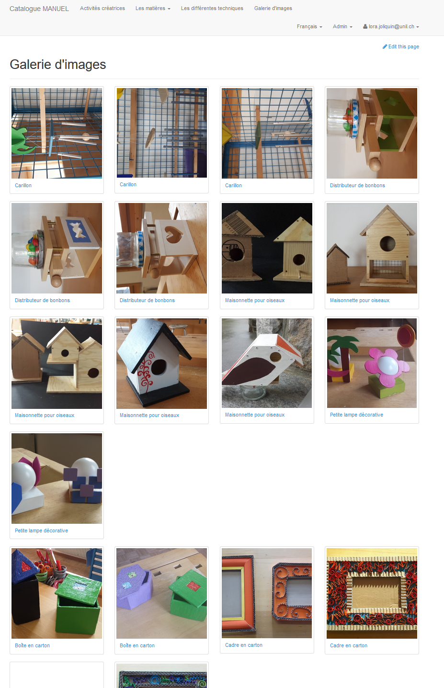

Vous pouvez aussi créer une **page mixte**, autrement dit composées de texte et d'images contenues dans les données de vos objets. Pour ce faire, vous créez une page contenant plusieurs des containers de types différents, vous les remplissez avec les textes de vous le souhaitez. 
>*Pour plus d'informations à ce sujet, référez-vous à la section : [Rubrique "Pages"](#rubrique-pages). *

Vous pouvez vous inspirez de l'exemple suivant:

Si vous voulez voir le résultat directement depuis le site de votre catalogue, vous cliquez sur "*Return to site*".
>*Attention: il faut que vous ayez mis votre page dans les réglages "Menu items" pour la voir s'afficher dans votre site, vous trouverez plus d'informations sous la section:  [Rubrique "Menu Items"](#rubrique-menu-items).*

Dans notre exemple de catalogue, la page mixte s'affiche ainsi :

###Organisation des objets sur le site
CATIMA affiche sur le site tous vos objets sous forme d'onglets. Il est prévu que cela soit organisé par ordre alphabétique, cependant vous pouvez changer cela en mettant en place votre propre organisation. Il vous faut aller sous "*Menu items*" et paramétrer les onglets comme vous le souhaitez. 
>*Pour plus d'informations à ce sujet, référez-vous à la section : [Rubrique "Menu items"](#rubrique-menu-items).*

Pour l'exemple de catalogue, nous avons souhaité jouer un peu avec les différentes possibilités que nous offre CATIMA. 

Nous avons opté pour un premier onglet qui présente un seul et unique objet, l'onglet suivant est une liste déroulante composée de pages, le troisième onglet est de nouveau un unique objet et le dernier onglet est une unique page composées des containers.
Toutes ces options sont décidées depuis le rubrique "*Menu items*". Le rang indique l'ordre de vos onglets. Vous remarquerez que deux des '*menus items*' ne possèdent pas de rang. C'est parce qu'ils ont comme parent le deuxième '*menu items*', soit "Les matières", et apparaitront donc dans le même onglet et sous forme de liste déroulante.

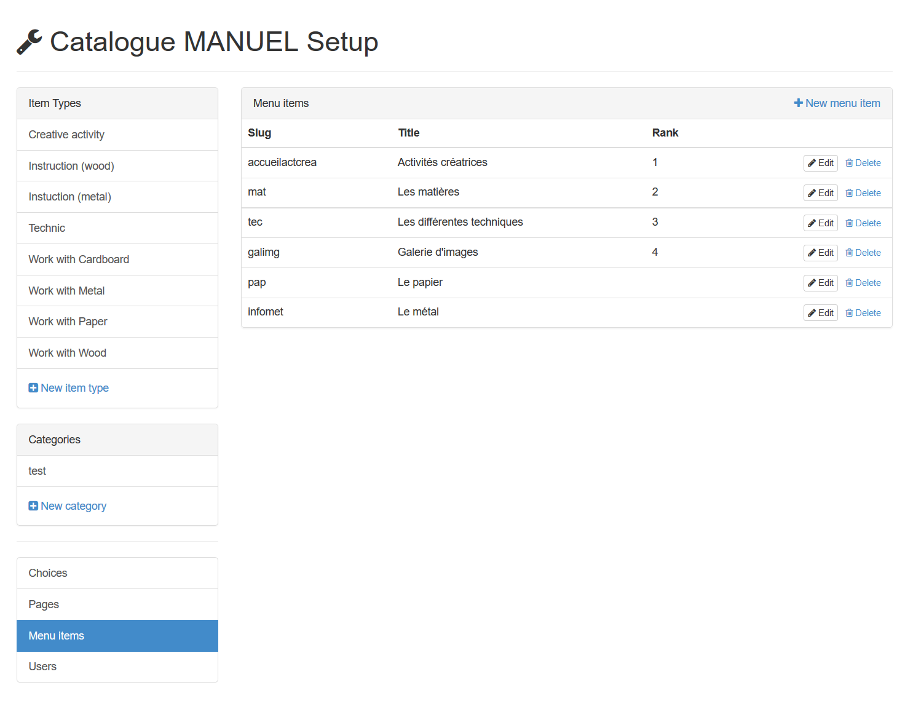

Vous arrivez à la fin de ce mode d'emploi. Nous espérons que vous y avez trouvé les informations nécessaires à votre réussite. N'hésitez pas à tester toutes les options possibles et à découvrir par vous-même tout ce que propose CATIMA, les modifications étant possibles en tout temps.

---

*Ce mode d'emploi a été préparé par Lora Joliquin*